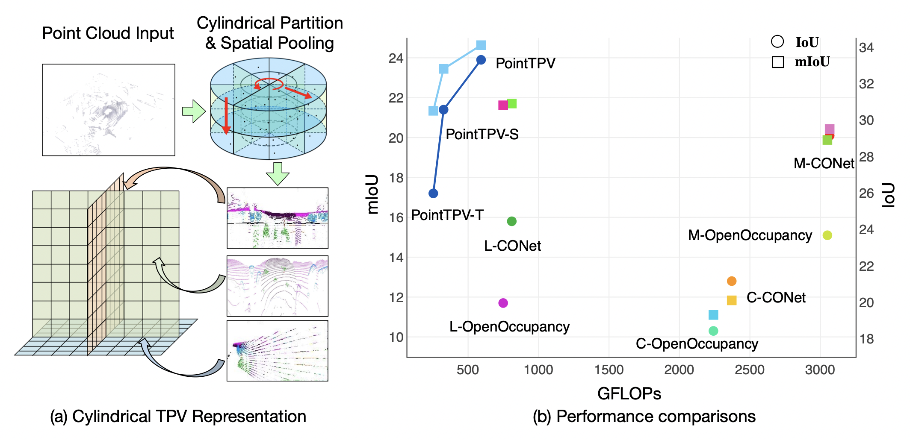
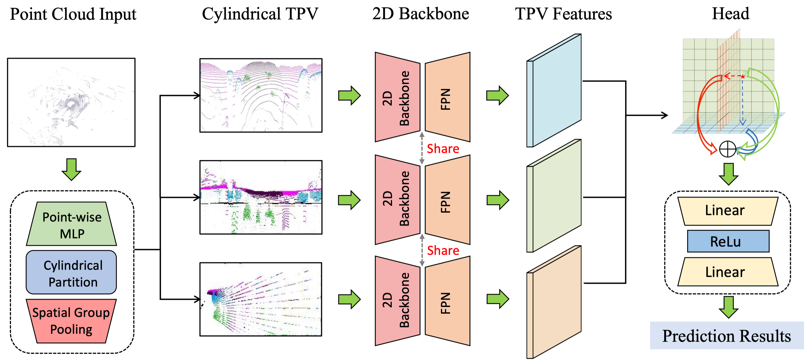
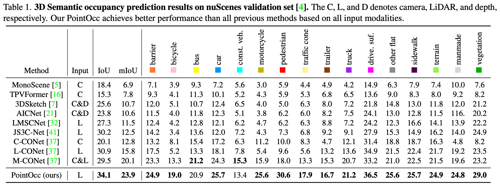
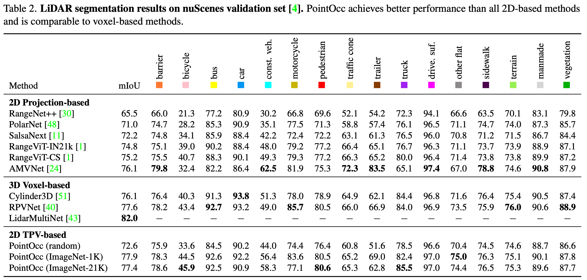

# PointOcc: Cylindrical Tri-Perspective View for Point-based 3D Semantic Occupancy Prediction

### [Paper](https://arxiv.org/pdf/2308.16896)

> PointOcc: Cylindrical Tri-Perspective View for Point-based 3D Semantic Occupancy Prediction

> Sicheng Zuo*, [Wenzhao Zheng](https://wzzheng.net/)\* $\dagger$, [Yuanhui Huang](https://scholar.google.com/citations?hl=zh-CN&user=LKVgsk4AAAAJ), [Jie Zhou](https://scholar.google.com/citations?user=6a79aPwAAAAJ&hl=en&authuser=1), [Jiwen Lu](http://ivg.au.tsinghua.edu.cn/Jiwen_Lu/)$\ddagger$

\* Equal contribution $\dagger$ Project leader $\ddagger$ Corresponding author

## Highlights

- **PointOcc enables the use of 2D image backbones for efficient point-based 3D semantic occupancy prediction.**
- **The Lidar-only PointOcc even outperforms Lidar & Camera multi-modal methods by a large margin.**



## Introduction

Semantic segmentation in autonomous driving has been undergoing an evolution from sparse point segmentation to dense voxel segmentation, where the objective is to predict the semantic occupancy of each voxel in the concerned 3D space. The dense nature of the prediction space has rendered existing efficient 2D-projection-based methods (e.g., bird's eye view, range view, etc.) ineffective, as they can only describe a subspace of the 3D scene. To address this, we propose a cylindrical tri-perspective view (TPV) to represent point clouds effectively and comprehensively and a PointOcc model to process them efficiently. Considering the distance distribution of LiDAR point clouds, we construct a tri-perspective view in the cylindrical coordinate system for more fine-grained modeling of nearer areas. We employ spatial group pooling to maintain structural details during projection and adopt 2D backbones to efficiently process each TPV plane. Finally, we obtain the features of each point by aggregating its projected features on each of the processed TPV planes without the need for any post-processing. Extensive experiments on both 3D occupancy prediction and LiDAR segmentation benchmarks demonstrate that the proposed PointOcc achieves state-of-the-art performance with much faster speed. Specifically, despite only using LiDAR, PointOcc significantly outperforms all other methods, including multi-modal methods, with a large margin on the OpenOccupancy benchmark.



## Results

### 3D Semantic Occupancy Prediction



### LiDAR Segmentation



## Installation

1. Create a conda environment and activate it.

```
conda create -n uniauto python=3.8
conda activate uniauto
```

2. Install PyTorch and torchvision following the [official instructions](https://pytorch.org/).

```
pip install torch==1.10.0+cu113 torchvision==0.11.0+cu113 torchaudio==0.10.0 -f https://download.pytorch.org/whl/torch_stable.html
```

3. Follow instructions in https://mmdetection3d.readthedocs.io/en/latest/get_started.html#installation to install mmcv-full, mmdet, mmsegmentation and mmdet3d

```
pip install -U openmim
mim install mmengine
mim install 'mmcv>=2.0.0rc4'
mim install 'mmdet>=3.0.0'
mim install mmsegmentation
mim install "mmdet3d>=1.1.0rc0"
```

4. install other packages

```
pip install timm==0.4.12
pip install torch_scatter
pip install spconv-cu113
#pip install numpy==1.19.5
#pip install numba==0.48.0
pip install scikit-image==0.19.3
pip install pandas==1.4.4
```

## Preparing

1. Download pretrain weights from [here](https://github.com/SwinTransformer/storage/releases/download/v1.0.0/swin_tiny_patch4_window7_224.pth) and put it in pretrain/
2. Create soft link from data/nuscenes to your_nuscenes_path 

## Getting Started

------

### Training

1. Train PointOcc for LiDAR segmentation task

   ```
   python train_seg.py --py-config config/pointtpv_nusc_lidarseg.py --work-dir work_dir/nusc_lidarseg/pointtpv
   ```

2. Train PointOcc for 3D semantic occupancy prediction task

   ```
   python train_occ.py --py-config config/pointtpv_nusc_occ.py --work-dir work_dir/nusc_occ/pointtpv
   ```

### Evaluation

1. Evaluate PointOcc for LiDAR segmentation task

   ```
   python eval_seg.py --py-config config/pointtpv_nusc_lidarseg.py --ckpt-path xxx --log-file work_dir/nusc_lidarseg/pointtpv/eval.log
   ```

2. Evaluate PointOcc for 3D semantic occupancy prediction task

   ```
   python eval_occ.py --py-config config/pointtpv_nusc_occ.py --ckpt-path xxx --log-file work_dir/nusc_occ/pointtpv/eval.log
   ```

## Related Projects

Our code mainly derives from [TPVFormer](https://github.com/wzzheng/tpvformer) and is also based on [Cylinder3D](https://github.com/xinge008/Cylinder3D). Many thanks to them!

## Citation

If you find this project helpful, please consider citing the following paper:
```
@article{pointocc,
    title={PointOcc: Cylindrical Tri-Perspective View for Point-based 3D Semantic Occupancy Prediction},
    author={Zuo, Sicheng and Zheng, Wenzhao and Huang, Yuanhui and Zhou, Jie and Lu, Jiwen},
    journal={arXiv preprint arXiv:2308.16896},
    year={2023}
}
```
